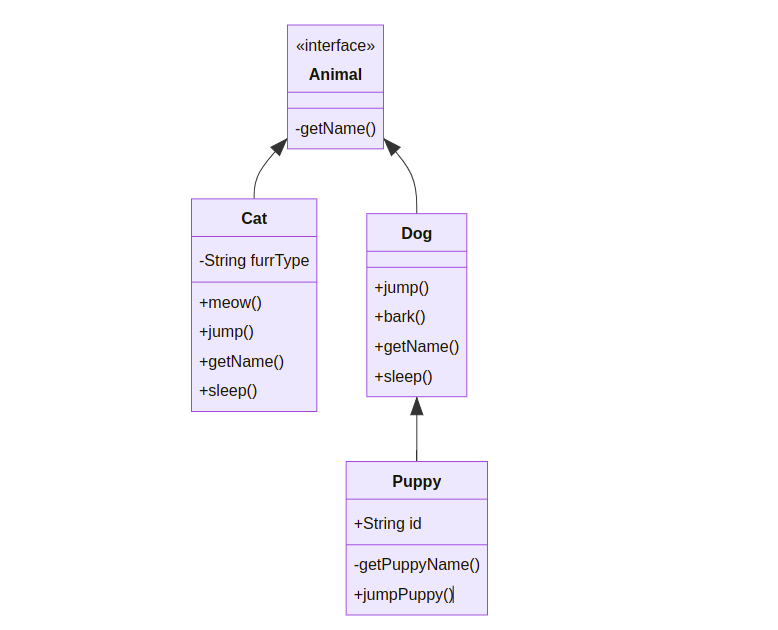

  
<h1> Class Diagram Generator in Java </h1>
Create UML Class diagrams using Java Annotations
   
   
  
  
  
  

## About
I wanted to build an utility app to create [UML Class diagrams](https://www.tutorialspoint.com/uml/uml_class_diagram.htm) from java code. But didn't wanted to spend so much to draw it. So, I created this project using annotations `@SuperClass` and `@ChildClass` above the class declaration, project will create new mermaid markdown code for UML class diagrams.
  

## Screenshots

## Technologies

I used `java` , `markdown` and `mermaid`. I have used java **[Reflection API](https://docs.oracle.com/javase/tutorial/reflect/index.html)** for scanning all the classes in the package. And some basic annotation processing.

## Setup And Usage

- You should have installed Jdk1.8
- Clone the repository or download the zip.
- Run Main class file for running the app. It will create new sample file [just like this](src/main/java/com/ap/cdgen/markdown/sample2.md) in markdown directory
- You can change `packagePath` if you want to point out to some other class hierarchy. 
- To view that markdown you can use [VSCode Markdown preview extension](https://marketplace.visualstudio.com/items?itemName=shd101wyy.markdown-preview-enhanced) or github gist or any markdown renderer. You should be able to see out [output](.github/screenshot.png) something like this.

## Status

Project is completed with all the features. You can request for new features. or Fork and create PR for the same. 

## Credits

List of contriubutors:

- [Ashish Pawar](https://github.com/ashishpawar517)
